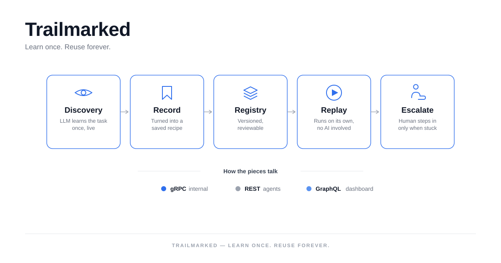
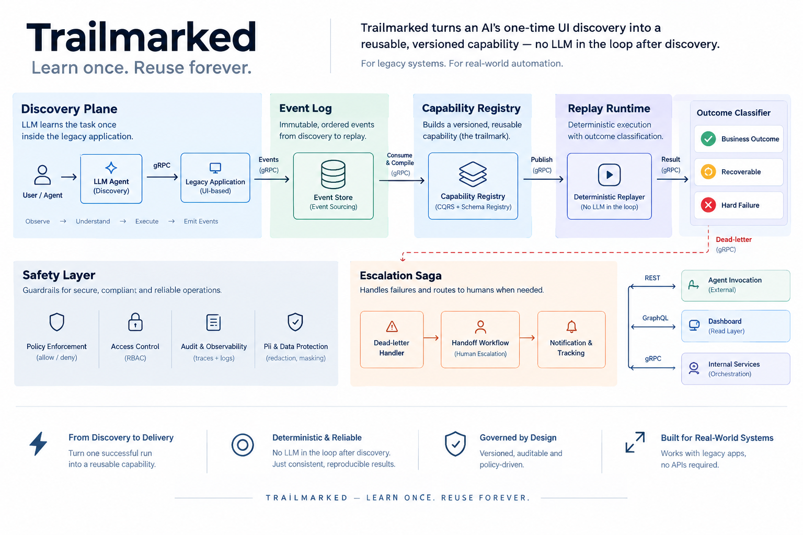

# Trailmarked

**A computer-use automation platform for banks and credit unions whose back-office
systems have no API.**

Most internal banking tools — core servicing screens, admin consoles, legacy
web apps — offer no integration surface at all. The only way in is the same
way a human operator gets in: by driving the UI. Trailmarked lets an LLM
learn a task once, by actually operating a live browser session, and turns
that single successful run into a **versioned, typed, replayable capability**
that an AI agent can invoke afterward — reliably and cheaply — without an LLM
making decisions ever again.

> **The model discovers once. The artifact becomes a reusable capability.
> Deterministic replay is how a production agent invokes it.**

<p align="center">
  
</p>

This repository is a working prototype of that idea, built end-to-end against
a self-contained mock banking application (so it runs with zero external
dependencies beyond an LLM API key). See [`REPORT.md`](REPORT.md) for the full
design write-up, and [`evidence/`](evidence/README.md) for a real, unscripted
LLM-driven discovery run, the capability it produced, and two replay runs
(one clean success, one that deliberately hits a runtime error and shows the
outcome classifier, dead-letter path, and human escalation in action).

## How it works, in one pass

1. **Discovery.** Point the system at a goal ("look up member 1001 and report
   their balance") and an entry URL. An LLM (Claude) drives a real headless
   browser turn by turn — read the page's accessibility tree, decide one
   action, execute it — until the goal is met.
2. **Trailmarking.** A successful run's full event trace is folded into a
   **capability artifact**: typed input parameters, an ordered list of steps
   (each with a primary locator plus fallbacks), a checkpoint the run actually
   asserted, and typed outputs. This artifact is versioned and diffed against
   any prior version (`BACKWARD` / `FORWARD` / `BREAKING`).
3. **Replay.** From then on, invoking that capability runs the recorded steps
   **with no LLM involved** — deterministic, fast, cheap. Every replay is
   classified into exactly one outcome: a legitimate `BUSINESS_OUTCOME`
   (success, or an expected result like "member not found"), a `RECOVERABLE`
   transient issue (retried with backoff), or a `HARD_FAILURE` (dead-lettered
   with full expected-vs-observed context and a screenshot). Each outcome
   also updates that capability version's **confidence** — see below.
4. **Escalation.** A hard failure automatically opens a human-in-the-loop
   saga. An operator can claim the **exact same live browser session** the
   automation was using, act on it, and release control — never a fresh
   session, and every hand-off step is itself an event.

## Architecture

<p align="center">
  
</p>

Every arrow above is a real, typed boundary, not a diagram simplification —
see [`REPORT.md`](REPORT.md) → *Architecture* for why gRPC internally, REST
for agent invocation, and GraphQL for the dashboard's read layer, each for a
different reason.

## What's in the box

| Piece | What it does |
|---|---|
| `mock_bank_app/` | A self-contained, deliberately legacy-styled banking UI (two tenants with different markup for the same flows) — the target the agent operates on |
| `services/discovery_plane` | The only component that calls an LLM — drives Playwright via accessibility-tree perception |
| `services/capability_registry` | Compiles a discovery run into a versioned capability; exposes it over gRPC (internal), REST (agent invocation), and GraphQL (dashboard reads) |
| `services/replay_runtime` | Executes a capability deterministically — idempotency, circuit breaker, retry, outcome classification, dead-lettering |
| `services/escalation_saga` | The human-handoff state machine (`AGENT_CONTROLLED → INTERVENTION_REQUESTED → HUMAN_CONTROLLED → CONTROL_RETURNED`) |
| `services/event_log` | The append-only event store everything above is built on |
| `dashboard/` | A live operator console — registry browser, live discovery timeline, replay console, escalation queue |

Everything runs as plain local processes over gRPC/HTTP on localhost — no
Docker, no message broker, no cloud dependency. See `REPORT.md` → *Cuts* for
exactly where a real broker or a real multi-tenant deployment would slot in
at production scale, and why building that now would be premature for a
prototype at this stage.

## Setup

Requires Python 3.11+ and Node 20+.

```bash
python3.11 -m venv .venv
.venv/bin/pip install -e .
.venv/bin/python -m playwright install chromium

cd dashboard && npm install && cd ..

export ANTHROPIC_API_KEY=sk-ant-...   # only needed to run a NEW discovery goal
```

No key is required to explore replay, the registry, or escalations —
`evidence/` ships a pre-compiled capability so those paths work immediately.

## Running it

```bash
python scripts/run.py
```

Boots five local processes:

| Service | Port | Protocol |
|---|---|---|
| `event_log` | 50051 | gRPC |
| `capability_registry` | 50052 | gRPC |
| `escalation_saga` | 50054 | gRPC |
| `replay_runtime` | 50053 | gRPC |
| gateway (REST + GraphQL + SSE) | 8000 | REST `/api`, GraphQL `/graphql`, SSE `/stream/{topic}` |
| mock bank app | 4000 | HTTP — two tenants at `/default/...` and `/overlay_demo/...` |

In a second terminal:

```bash
cd dashboard && npm run dev
```

Open `http://localhost:5173`. The Registry, Replay, and Escalations tabs
work immediately. The Discovery tab shows a live event timeline while a
discovery run (started from the CLI, below) is in progress.

## Demo: discover a capability, then replay it three ways

With `scripts/run.py` running:

```bash
# 1. Discover — an LLM drives the browser once and the run compiles into a capability.
python -m services.discovery_plane.cli \
  --goal "Look up member 1001 and report their current balance" \
  --capability-id member_balance_lookup --tenant default \
  --base-url http://localhost:4000/default/members --input member_id=1001

# 2. Replay it — same member id, no LLM this time. Outcome: BUSINESS_OUTCOME (success).
python -m services.replay_runtime.cli \
  --capability-id member_balance_lookup --tenant default \
  --input entry_url=http://localhost:4000/default/members --input member_id=1001

# 3. Replay against a legitimate business outcome — a member that doesn't exist.
#    Outcome: BUSINESS_OUTCOME ("member not found" is a real answer, not a crash).
python -m services.replay_runtime.cli \
  --capability-id member_balance_lookup --tenant default \
  --input entry_url=http://localhost:4000/default/members --input member_id=0000

# 4. Replay against a real member the capability wasn't recorded against —
#    a step whose expected content was captured from member 1001 genuinely
#    doesn't hold for member 1002 (which exact step depends on what the LLM
#    asserted/extracted during discovery). Outcome: HARD_FAILURE, dead-lettered
#    with expected/observed context and a screenshot, and an escalation saga
#    opens automatically (see the Escalations tab).
python -m services.replay_runtime.cli \
  --capability-id member_balance_lookup --tenant default \
  --input entry_url=http://localhost:4000/default/members --input member_id=1002
```

Watch it in the dashboard as you go: the Registry tab shows the compiled
capability, its checkpoint, and every run's full event timeline; the Replay
tab can submit any of the above from a generated form, color-coded by
outcome; the Escalations tab shows the saga opened by command 4, with
claim/act/release controls against the live session.

### Tenant overlay

The mock bank app ships two tenants — `default` and `overlay_demo` — serving
the same two flows through genuinely different markup (different labels,
different element structure, different button copy). Run discovery again
with `--tenant overlay_demo`, or replay the existing capability with
`tenant_id=overlay_demo`, to see the registry resolve a tenant-specific
locator overlay instead of the base capability's locators — the mechanism
for reusing one capability across many institutions running the same
underlying vendor product.

### Confidence tracking — what happens if the recorded flow goes stale

Nothing checks a capability against the live app *before* a replay starts —
drift is only ever discovered by actually trying (a locator's fallback
chain absorbs small changes silently; a checkpoint catches a wrong page
before data gets extracted off it; a hard failure gets dead-lettered and
escalated). To make that history visible instead of implicit, every replay
updates the capability version's confidence:

- `last_validated_at_ms` — set whenever a replay reaches `BUSINESS_OUTCOME`.
- `consecutive_hard_failures` — incremented on `HARD_FAILURE`, reset on success.
- a derived **`FRESH` / `NEEDS_REVIEW`** label (`NEEDS_REVIEW` if it's never
  been validated, or has hard-failed twice in a row since it last was) —
  shown as a badge next to each version in the Registry tab.

Run the demo's command 4 (or 2 replay calls with a bad input in a row) and
watch a version flip from `FRESH` to `NEEDS_REVIEW` in the Registry tab.

This is intentionally just a signal, not an action. It does **not**
automatically kick off a new discovery run, and it doesn't gate replay by
itself — a system that decided on its own when to re-spend an LLM call
against a live production app would break the platform's own core rule that
replay never involves the LLM and a human is always the one who decides to
re-invoke it. `NEEDS_REVIEW` just means: someone should look at this before
trusting it unattended.

## Running without live services

- The mock bank app needs nothing external — a self-contained FastAPI app
  with in-memory data.
- Every other service needs nothing external either, *except*
  `discovery_plane`, which calls the Anthropic API. Replay, the registry,
  the escalation saga, and the dashboard all work fully offline once at
  least one capability exists — `evidence/` includes a pre-compiled one so
  the Replay and Registry tabs have something real to show without ever
  calling an LLM.

## Verifying it after a change

There's no separate test suite; the flows in [`evidence/README.md`](evidence/README.md)
(discovery → compile → replay success → replay hitting a business outcome →
replay hard-failing into the dead-letter and escalation path) are the most
direct way to re-verify the system end-to-end, and are exactly the commands
above.
